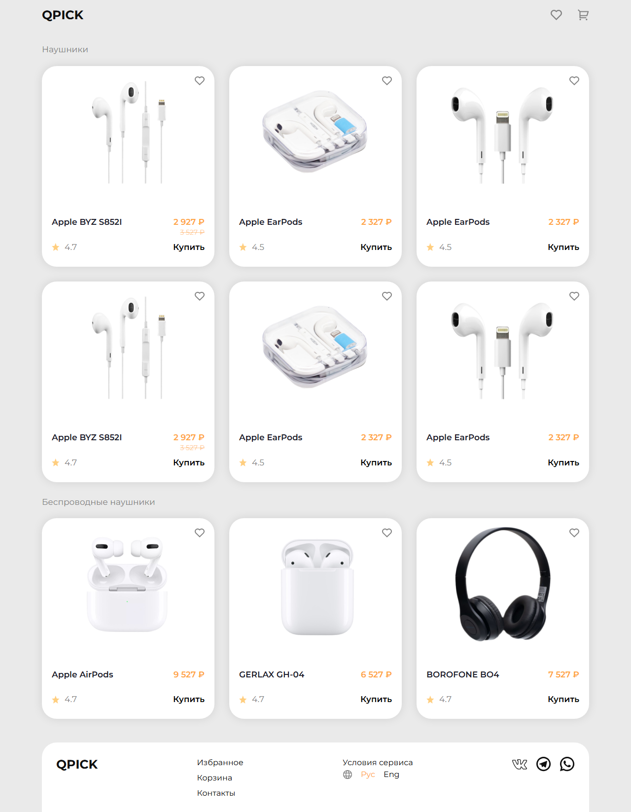

# QPICK — тестовое задание Neoflex

SPA магазина аудиоаксессуаров по [макету Figma](https://www.figma.com/design/qw44OPediu3iquaSvkLtqa/Neoflex-Invite-Test--Copy---Copy-?node-id=0-1).



**Другие экраны:** [планшет](docs/screenshots/02-catalog-tablet.png) · [мобильный](docs/screenshots/03-catalog-mobile.png) · [корзина](docs/screenshots/04-cart-desktop.png) · [избранное](docs/screenshots/05-favourite-desktop.png) · [оформление](docs/screenshots/06-checkout-desktop.png) · [модалка товара](docs/screenshots/07-product-hover-modal.png)

---

## Что сделано

| Раздел | Суть |
| --- | --- |
| Каталог | две секции товаров, карточка с ценой, рейтингом, «Купить», избранное |
| Корзина | добавление, ±, удаление, итого, переход на checkout |
| Избранное | localStorage, чекбоксы, перенос выбранного в корзину |
| Модалка | hover 1,5 с на карточке каталога, затемнение экрана, описание-заглушка |
| Оформление | отдельный роут, сумма заказа, экран загрузки |
| Роутинг | `/`, `/cart`, `/favourite`, `/checkout`, 404 |
| Состояние | `CartContext` / `FavouriteContext`, persist в localStorage |

**Стек:** React 19, TypeScript, Vite 8, Tailwind 4, React Router 7.

---

## Запуск

```bash
npm install
npm run dev
```

```bash
npm run build
npm run preview
npm run lint
```

---

## Структура

```
src/pages/          CatalogPage, CartPage, FavouritePage, CheckoutPage, NotFound
src/components/     Card, Header, Footer, Layout, OrderSummary, ProductHoverDetails
src/context/        корзина и избранное
src/data/catalog.ts товары
docs/screenshots/   скриншоты
```
